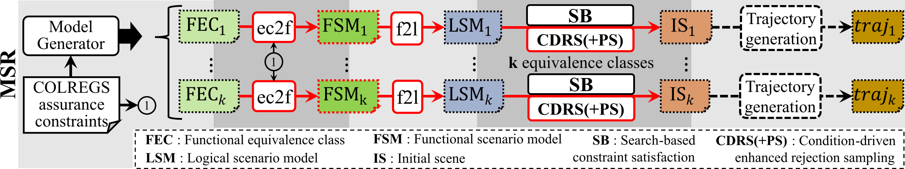

# Automated Generation of Functionally Complete Assurance Suites for COLREGS-Compliance of Autonomous Surface Vehicles

Research software and **MODELS26 artifact evaluation package** for generating and evaluating initial scenes for Autonomous Surface Vehicle (ASV) scenario-based assurance. The project implements genetic algorithms, rejection sampling, and evolutionary computation for scene generation using the **MSR** and **DC** approaches, with detailed visualization and statistical evaluation tooling.

This repository is supplementary material for the paper **Automated Generation of Functionally Complete Assurance Suites for COLREGS-Compliance of Autonomous Surface Vehicles**.


## Zenodo archives

Published MODELS26 artifacts on Zenodo (for reviewers and offline use):

| Artifact | Zenodo record | Version | License |
|----------|---------------|---------|---------|
| Software code | [10.5281/zenodo.19246756](https://doi.org/10.5281/zenodo.19246756) | Version 3.0 | MIT |
| Measurement data | [10.5281/zenodo.20792733](https://doi.org/10.5281/zenodo.20792733) | Version 1.0 | CC-BY 4.0 |

Download `MSR_ASV_SceneGeneration-main.zip` from the software record, or clone from GitHub (see [Installation](#installation)). Load measurement files from the data record via **Data Manager -> Download from Zenodo**, or upload a downloaded `.pkl.gz` manually.


---

## Table of contents

- [Automated Generation of Functionally Complete Assurance Suites for COLREGS-Compliance of Autonomous Surface Vehicles](#automated-generation-of-functionally-complete-assurance-suites-for-colregs-compliance-of-autonomous-surface-vehicles)
  - [Zenodo archives](#zenodo-archives)
  - [Table of contents](#table-of-contents)
  - [Overview](#overview)
  - [Quick start (Docker)](#quick-start-docker)
  - [Installation](#installation)
    - [Docker (recommended)](#docker-recommended)
      - [Prerequisites](#prerequisites)
      - [Step-by-step](#step-by-step)
      - [Zenodo dataset](#zenodo-dataset)
      - [Docker troubleshooting](#docker-troubleshooting)
    - [Local installation without Docker](#local-installation-without-docker)
      - [Prerequisites](#prerequisites-1)
      - [Linux system packages (non-Docker only)](#linux-system-packages-non-docker-only)
      - [Step-by-step](#step-by-step-1)
      - [Local upload size limit](#local-upload-size-limit)
  - [Running the web demonstrator](#running-the-web-demonstrator)
  - [How the UI works](#how-the-ui-works)
    - [Background jobs](#background-jobs)
    - [Cancellation and partial results](#cancellation-and-partial-results)
    - [Active dataset](#active-dataset)
    - [Plots in the browser](#plots-in-the-browser)
  - [UI pages and functionality](#ui-pages-and-functionality)
    - [Home](#home)
    - [Data Manager](#data-manager)
      - [Compress](#compress)
      - [Load](#load)
      - [Annotate Hash](#annotate-hash)
      - [Unzip](#unzip)
    - [Scenario Browser](#scenario-browser)
    - [Evaluation Plots](#evaluation-plots)
    - [Scene Generation](#scene-generation)
    - [Hyperparam Tuning](#hyperparam-tuning)
    - [Hyperparam Evaluation](#hyperparam-evaluation)
    - [Trajectories](#trajectories)
  - [Recommended data workflow](#recommended-data-workflow)
  - [Kick-the-tires walkthrough (~30 minutes)](#kick-the-tires-walkthrough-30-minutes)
  - [Full paper reproduction](#full-paper-reproduction)
  - [Datasets and Zenodo](#datasets-and-zenodo)
  - [Hardware and software requirements](#hardware-and-software-requirements)
  - [Environment variables](#environment-variables)
  - [Output and job artifacts](#output-and-job-artifacts)
  - [Project structure](#project-structure)
    - [Research components (brief)](#research-components-brief)
  - [Badges and licensing](#badges-and-licensing)
  - [Citation](#citation)

---

## Overview

All artifact evaluation workflows are exposed through a **browser-based Streamlit demonstrator** (`src/artifact_ui/`). You do not need to run individual Python scripts from the terminal to reproduce the paper experiments: scene generation, hyperparameter tuning, trajectory synthesis, data preparation, plotting, and scenario browsing are available as named pages in the web application.

Long-running operations (scene generation, hyperparameter tuning, trajectory generation, Zenodo download, data compression) run in **isolated background worker processes**. The UI remains responsive, shows live logs, supports cancellation, and offers **download buttons** for completed or partially completed results directly in the browser.

---

## Quick start (Docker)

If Docker is installed, the fastest path to the demonstrator is:

Clone the repository, or unzip a downloaded source archive (from GitHub or Zenodo), then from the project root:

```bash
git clone https://github.com/PELAB-LiU/MSR_ASV_SceneGeneration.git
cd MSR_ASV_SceneGeneration
docker compose up --build
```

If you used a zip archive instead of `git clone`, skip the clone step and `cd` into the extracted folder before running `docker compose up --build`.

Open **http://localhost:8501** in a web browser.

The first build downloads Python dependencies and may take several minutes. Subsequent starts are much faster.

---

## Installation

### Docker (recommended)

Docker provides a reproducible environment matching the MODELS26 artifact evaluation setup: Python 3.12, pinned dependencies, headless plotting (`MPLBACKEND=Agg`), and preconfigured paths for data and job output.

#### Prerequisites

- **Docker Engine** 24 or newer
- **Docker Compose** v2 (`docker compose`, not legacy `docker-compose`)
- **4+ CPU cores** and **8+ GB RAM** recommended (32 GB for full paper-scale runs)
- **~10 GB free disk** for the image, uploaded data, job output, and optional Zenodo download
- A modern web browser (Chrome, Firefox, Edge, Safari)

#### Step-by-step

1. **Obtain the source**

   Clone the repository, or unzip a downloaded source archive (from GitHub or Zenodo), and open a terminal in the project root.

   With git:

   ```bash
   git clone https://github.com/PELAB-LiU/MSR_ASV_SceneGeneration.git
   cd MSR_ASV_SceneGeneration
   ```

   If you extracted a zip archive, `cd` into the extracted folder instead.

2. **Review `docker-compose.yml`** (optional)

   Default host port mapping is `8501:8501`. Data and output are persisted on the host:

   | Host path   | Container path | Purpose                                      |
   |-------------|----------------|----------------------------------------------|
   | `./data`    | `/data`        | Uploaded datasets, Zenodo download cache     |
   | `./output`  | `/output`      | Job logs, downloadable archives, job state   |

3. **Build and start**

   ```bash
   docker compose up --build
   ```

   To run detached in the background:

   ```bash
   docker compose up --build -d
   ```

4. **Open the UI**

   Navigate to **http://localhost:8501**.

5. **Stopping**

   Press `Ctrl+C` in the terminal, or:

   ```bash
   docker compose down
   ```

#### Zenodo dataset

The default measurement-data DOI from [Zenodo archives](#zenodo-archives) is hardcoded in `src/utils/artifact_config.py` and used by **Data Manager -> Download from Zenodo**.

#### Docker troubleshooting

| Issue | Suggestion |
|-------|------------|
| Port 8501 already in use | Change the port mapping in `docker-compose.yml`, e.g. `"8502:8501"`, then open `http://localhost:8502`. |
| Build fails on dependency install | Ensure network access; retry `docker compose build --no-cache`. |
| Upload rejected | Default max upload is **300 MB** per file (`STREAMLIT_SERVER_MAX_UPLOAD_SIZE`). |
| RRT / multiprocessing errors | `shm_size: "2gb"` is set in `docker-compose.yml`; increase if needed on very large trajectory jobs. |
| Permission errors on `./data` or `./output` | Ensure the Docker user can write to these host directories. |

---

### Local installation without Docker

Use this path when Docker is unavailable or when developing changes to the UI. The same Streamlit application runs on the host Python interpreter.

#### Prerequisites

- **Python 3.12** (paper measurements used Python 3.12 on Ubuntu 24.04)
- **pip** (bundled with Python)
- **4+ CPU cores** and **8+ GB RAM** recommended
- A modern web browser

#### Linux system packages (non-Docker only)

On Debian/Ubuntu Linux, install native libraries required by **scipy**, **pygame**, and **matplotlib** before running the Python dependency installer. The Docker image installs these automatically via `apt-get`; Windows and macOS pip wheels usually bundle what they need.

```bash
sudo apt-get update && sudo apt-get install -y --no-install-recommends \
    libgl1 \
    libglib2.0-0 \
    libgomp1 \
    libsm6 \
    libxext6 \
    libxrender1
```

A full desktop Ubuntu install may already include these packages. If `python scripts/install_dependencies.py` succeeds but imports fail with a missing shared-library error (for example `libgomp.so` or `libGL.so`), run the command above.

#### Step-by-step

1. **Obtain the source**

   Clone the repository, or unzip a downloaded source archive (from GitHub or Zenodo), and open a terminal in the project root.

   With git:

   ```bash
   git clone https://github.com/PELAB-LiU/MSR_ASV_SceneGeneration.git
   cd MSR_ASV_SceneGeneration
   ```

   If you extracted a zip archive, `cd` into the extracted folder instead.

2. **Create and activate a virtual environment**

   Linux / macOS:

   ```bash
   python3.12 -m venv env
   source env/bin/activate
   ```

   Windows (PowerShell or Command Prompt):

   ```bash
   python -m venv env
   env\Scripts\activate
   ```

3. **Install pinned dependencies**

   Dependencies are declared in `package.json` under `pythonDependencies`. Platform-specific packages (e.g. `pywin32` on Windows) are selected automatically.

   ```bash
   python scripts/install_dependencies.py
   ```

   Or, if Node.js is available:

   ```bash
   npm run install:deps
   ```

   Streamlit is installed by the dependency script or can be added explicitly:

   ```bash
   pip install streamlit requests
   ```

4. **Set environment variables**

   Linux / macOS:

   ```bash
   export PYTHONPATH=src
   export ARTIFACT_DATA_DIR=./data
   export ARTIFACT_OUTPUT_DIR=./output
   export MPLBACKEND=Agg
   export ENABLE_RRT_ANIMATION=false
   ```

   Windows (Command Prompt):

   ```cmd
   set PYTHONPATH=src
   set ARTIFACT_DATA_DIR=.\data
   set ARTIFACT_OUTPUT_DIR=.\output
   set MPLBACKEND=Agg
   set ENABLE_RRT_ANIMATION=false
   ```

   Windows (PowerShell):

   ```powershell
   $env:PYTHONPATH = "src"
   $env:ARTIFACT_DATA_DIR = ".\data"
   $env:ARTIFACT_OUTPUT_DIR = ".\output"
   $env:MPLBACKEND = "Agg"
   $env:ENABLE_RRT_ANIMATION = "false"
   ```

   Windows (Git Bash): use the same `export` syntax as Linux/macOS:

   ```bash
   export PYTHONPATH=src
   export ARTIFACT_DATA_DIR=./data
   export ARTIFACT_OUTPUT_DIR=./output
   export MPLBACKEND=Agg
   export ENABLE_RRT_ANIMATION=false
   ```

   `PYTHONPATH` is optional for the Streamlit entry point (`app.py` adds `src/` automatically), but other CLI scripts still need it.

   Create data directories:

   ```bash
   mkdir -p data/full data/uploads output/jobs
   ```

5. **Start the demonstrator**

   ```bash
   streamlit run src/artifact_ui/app.py
   ```

   Open the URL printed in the terminal (default **http://localhost:8501**).

#### Local upload size limit

Browser uploads are limited to **300 MB** per file, configured in `.streamlit/config.toml` (`server.maxUploadSize` and `server.maxMessageSize`). For Docker, the same limits are passed on the Streamlit command line in the `Dockerfile`.

---

## Running the web demonstrator

Regardless of installation method, the entry point is always:

```bash
streamlit run src/artifact_ui/app.py
```

(In Docker this command is the container `CMD`.)

Navigation is organized into pages via the sidebar:

| Page | Purpose |
|------|---------|
| **Home** | Artifact introduction, data workflow diagram, time budget table |
| **Data Manager** | Load, compress, annotate, unzip evaluation datasets |
| **Scenario Browser** | Tabular browse + COLREG scene visualization |
| **Evaluation Plots** | Paper-style statistical figures from loaded data |
| **Scene Generation** | Run constraint-satisfaction scene generation (paper approaches) |
| **Hyperparam Tuning** | NSGA-III hyperparameter search |
| **Hyperparam Evaluation** | Rank tuning results from uploaded JSON measurements |
| **Trajectories** | Headless RRT* trajectory generation for a selected scene |

The **sidebar** shows whether a background job is running and provides a **Cancel** button. The **job panel** at the bottom of every page streams logs and exposes download buttons when results (or partial results) are available.

---

## How the UI works

### Background jobs

When you start scene generation, hyperparameter tuning, trajectories, compression, annotation, unzip, or Zenodo download, the UI:

1. Creates a unique job directory under `ARTIFACT_OUTPUT_DIR/jobs/<job_id>/`.
2. Spawns a **separate Python subprocess** (`artifact_ui.job_entry`) so Streamlit never blocks.
3. Writes `run.log` incrementally and `result.json` when the job finishes or is interrupted.
4. Packages outputs for browser download (`.pkl.gz` for compress/annotate; zip archives for generation jobs and trajectories).

Only **one job** runs at a time. Controls on other pages are disabled while a job is active.

### Cancellation and partial results

Cancelling a running **scene generation**, **hyperparameter tuning**, or **trajectory** job packages whatever measurement data was already written to disk and enables a **partial results** download. This allows you to inspect intermediate output without waiting for full completion.

### Active dataset

Many pages require a **loaded dataset** (a `.pkl.gz` file selected in **Data Manager -> Load**). The UI stores only the file name in session state; the file itself remains on the server under `ARTIFACT_DATA_DIR/uploads` or the Zenodo cache.

### Plots in the browser

**Scenario Browser** and **Evaluation Plots** render both a static PNG preview and an interactive Plotly chart. You can download PNG or HTML exports from the plot panel.

---

## UI pages and functionality

### Home

- Introduces the MODELS26 artifact goals and badge targets (**Artifact Evaluated: Reusable**, **Artifact Available**).
- Explains the recommended data workflow with a diagram (`assets/images/usage.svg`): generate -> compress -> annotate -> load, or load from Zenodo directly, then analyze.
- Lists a **kick-the-tires checklist** and a **global time budget** table (worst-case formulas for scene generation, hyperparameter tuning, trajectories, and data utilities).

### Data Manager

Four tabs cover all dataset I/O:

#### Compress

- Upload measurement files from your computer: individual `.json` files, `.pkl.gz` archives, or a `.zip` of a measurement tree.
- Merges many JSON records into a **single compressed `.pkl.gz`** suitable for fast loading in the UI.
- Download the result as `compressed.pkl.gz` when the job completes.

#### Load

- **Upload** a `.pkl.gz` from your computer for browsing and plotting.
- **Download from Zenodo**: fetches the full published dataset into `data/full/` (configurable DOI).
- **Load Zenodo dataset**: registers the downloaded archive as the active dataset.
- Shows the **active dataset** name used by other pages.

#### Annotate Hash

- Adds **functional equivalence-class hash** fields to each measurement record. Hashing requires a unified pass over the full dataset and is intended to run **after compression**.
- Accepts an uploaded `.pkl.gz` or the active loaded dataset.
- Download the result as `annotated.pkl.gz`.

#### Unzip

- Expands a compressed `.pkl.gz` back into individual JSON files (useful for external tools or hyperparameter evaluation uploads).
- Download output as a zip archive of the extracted tree.

### Scenario Browser

Requires a loaded dataset.

- Displays an interactive **dataframe** of all evaluation records (metrics, approach, vessel count, validity flags, etc.).
- Select a **row index** and click **Render COLREG scene** to visualize the `best_scene` for that record.
- Shows a **matplotlib** top-down COLREG scene plot plus an interactive **Plotly** view.
- Download PNG or HTML exports of the rendered scene.

### Evaluation Plots

Requires a loaded dataset.

- Choose one of four **paper-style figures** (see descriptions below), then click **Generate plot**.
- Displays static matplotlib PNG and an interactive **Plotly** version; supports PNG/HTML download.

| Plot | Description |
|------|-------------|
| **Relevant Coverage Evolution** | Cumulative **relevant FEC coverage** (%) over wall-clock evaluation time for each paper approach, vessel count, and random seed. Shows how quickly each configuration discovers new functionally relevant equivalence classes. |
| **Relevant Coverage** | Final **relevant FEC coverage** (%) per approach and vessel count after all scheduled scenarios finish. Bars aggregate seeds; asterisks mark statistically significant pairwise differences (Mann–Whitney U with effect size). |
| **Time to 100% Coverage** | Wall-clock time until **100% of relevant FECs** are covered for each approach and vessel count. Only runs that reach full coverage contribute; compares how long complete assurance-suite generation takes across configurations. |
| **Time Per Eqv Class** | Mean evaluation time per **newly covered relevant equivalence class** (graph-shape hash), averaged over seeds. Lower values indicate faster discovery of distinct functional scenarios; includes statistical comparison markers. |

### Scene Generation

Runs the core **constraint satisfaction** evaluation pipeline (formerly `evaluation_main.py`) with user-selected parameters:

- **Approaches**: multiselect of paper configurations (MSR/CDRS, search-based NSGA-II/III, rejection sampling, etc.). Each option maps to a row of *Table: Configurations of compared approaches* in the paper. Non-paper configurations are omitted.
- **Vessel counts**: 2 through 6 (obstacle count fixed at 0 in the artifact UI).
- **Random seeds**: repeat the full batch with different pseudo-random initializations for statistical significance (paper uses 30; use 1 for exploration).
- **CPU cores**: parallel scheduler workers.
- **Verbose logging**: per-scenario FEC progress and solver diagnostics in the job log.
- **Worst-case / typical time estimates** displayed before launch. Rejection-sampling approaches are flagged as **unbounded** (no global timeout).

On completion (or cancellation), download a **zip archive** of generated measurement JSON trees under `assets/gen_data/`.

### Hyperparam Tuning

Explores **NSGA-III hyperparameters** (population size, mutation/crossover settings) for DC or MSR search-based configurations:

- **Max combinations**: how many hyperparameter tuples to evaluate. Each combination uses population sizes `{2, 4, 8, 15, 30}` in order with fixed mutation/crossover parameters, running a full measurement batch across all logical scenarios for the selected vessel count.
- **Planned combinations** expander lists exact settings before you run.
- **Verbose logging** runs combinations sequentially and logs start/finish with remaining count.
- Download results zip from the job panel.

### Hyperparam Evaluation

Ranks hyperparameter tuning output (formerly `evaluate_hyperparameters.py`):

- Upload JSON measurement files or a zip of a tuning result tree.
- Produces a summary **dataframe** of best configurations.
- Download results as `hyperparam_evaluation.zip` containing a CSV.

This page runs synchronously in the Streamlit process (fast analysis, not a background job).

### Trajectories

Requires a loaded dataset.

- Select a **record index** whose `best_scene` will be used as the initial configuration.
- Runs **headless bidirectional RRT\*** (`ENABLE_RRT_ANIMATION=false`) in a background job.
- **Verbose logging** prints RRT iteration details (closest node, distance to goal).
- Download trajectory outputs as a zip archive when the job completes or is cancelled with partial progress.

---

## Recommended data workflow

Scene generation produces many separate JSON files on the server. For practical analysis inside the UI, use a single compressed, annotated `.pkl.gz` archive:



### Generate your own measurements

1. **Scene Generation**: run a job and download the result zip.
2. **Data Manager -> Compress**: merge JSON into one `.pkl.gz` and download.
3. **Data Manager -> Annotate hash**: add graph-shape hash fields for functional equivalence-class analysis (must run on the full compressed archive); download when done.
4. **Data Manager -> Load**: activate the annotated `.pkl.gz` as the active dataset.

### Use the published Zenodo dataset

1. **Data Manager -> Load**: download from Zenodo and load a pre-annotated `.pkl.gz` (skips compress and annotate).

### Analyze the active dataset

Use **Scenario Browser**, **Evaluation Plots**, **Trajectories**, and **Hyperparam Evaluation** on the loaded data.

### Optional utility

- **Data Manager -> Unzip**: export human-readable JSON from a loaded archive.

---

## Kick-the-tires walkthrough (~30 minutes)

Designed to complete on a commodity laptop without full paper-scale runtime:

1. Start the demonstrator (`docker compose up --build` or local Streamlit).

**Explore published data (fastest)**

2. **Data Manager -> Load**: download from Zenodo and load a pre-annotated `.pkl.gz`, or upload a small archive from your computer (full Zenodo download may exceed 30 minutes on slow links).
3. **Scenario Browser**: inspect the table; render one COLREG scene.
4. **Evaluation Plots**: generate one plot type from the loaded dataset.

**Try the generation pipeline (optional)**

5. **Scene Generation**: minimal run: **1 seed**, **1 approach** (e.g. MSR CDRS+PS), **2 or 3 vessels**, **1 core**; download the result zip when the job finishes.
6. **Data Manager -> Compress**, then **Annotate hash**, then **Load** the processed archive (see [recommended data workflow](#recommended-data-workflow)).

**Optional**

7. **Trajectories** on one record; **Hyperparam Evaluation** on uploaded tuning JSON; **Unzip** for human-readable JSON exports.

The **Home** page lists worst-case time formulas so you can verify estimates before starting long jobs.

---

## Full paper reproduction

Use **Scene Generation** with paper parameters:

| Parameter | Paper value |
|-----------|-------------|
| Seeds | 30 |
| Approaches | All paper configurations (`sb-msr2` through `ts-rs` as listed in the UI) |
| Vessel counts | 2, 3, 4, 5, 6 |
| CPU cores | All available |

The UI displays **worst-case duration** before starting. Rejection-sampling approaches (`rs`, `cd-rs`, `ts-rs`) may run without a global timeout and can dominate total wall time.

Paper measurements were taken on **Ubuntu 24.04**, **Python 3.12**, **32 GB RAM**, Intel Haswell-class CPU.

After generation, follow the [recommended data workflow](#recommended-data-workflow) to compress, annotate, and analyze results in **Evaluation Plots**.

---

## Datasets and Zenodo

Licenses and DOIs are listed under [Zenodo archives](#zenodo-archives). The artifact UI does **not** bundle the full dataset inside the Docker image. Acquire it by:

- **Data Manager -> Download from Zenodo**, or
- Uploading a `.pkl.gz` or JSON measurements downloaded from the measurement-data record.

---

## Hardware and software requirements

See also `REQUIREMENTS.md`.

| Resource | Minimum | Recommended (full reproduction) |
|----------|---------|----------------------------------|
| CPU | 4 cores | 8+ cores |
| RAM | 8 GB | 32 GB |
| Disk | 10 GB free | 50+ GB if storing full Zenodo download and generation output |
| Display | Web browser only | Same |
| Docker | Engine 24+, Compose v2 | Same |
| Python (non-Docker) | 3.12 | 3.12 |

---

## Environment variables

| Variable | Default (Docker) | Description |
|----------|------------------|-------------|
| `PYTHONPATH` | `/app/src` | Must include `src/` so imports resolve |
| `ARTIFACT_DATA_DIR` | `/data` | Uploads and Zenodo cache |
| `ARTIFACT_OUTPUT_DIR` | `/output` | Job directories and downloadable artifacts |
| `MPLBACKEND` | `Agg` | Headless matplotlib |
| `ENABLE_RRT_ANIMATION` | `false` | Disable pygame RRT animation in artifact mode |
| `STREAMLIT_SERVER_MAX_UPLOAD_SIZE` | `300` | Max browser upload size (MB) |
| `STREAMLIT_SERVER_MAX_MESSAGE_SIZE` | `300` | Max WebSocket message size (MB) |

---

## Output and job artifacts

| Location | Contents |
|----------|----------|
| `ARTIFACT_OUTPUT_DIR/jobs/<job_id>/run.log` | Timestamped worker log |
| `ARTIFACT_OUTPUT_DIR/jobs/<job_id>/result.json` | Status, error message, paths to downloadable files |
| `ARTIFACT_OUTPUT_DIR/jobs/<job_id>/*.zip` / `*.pkl.gz` | Packaged downloads served to the browser |
| `assets/gen_data/` (internal) | Generated measurement JSON trees (scene gen, hyperparam, trajectories): exposed via job download zips, not directly in the UI file browser |

In Docker with default volumes, host paths are `./output/` and `./data/`.

---

## Project structure

High-level layout of the research codebase (the UI orchestrates these modules; you do not need to invoke them manually):

```
├── assets/                    # Images, Scenic scenarios, functional models
├── refinery_functional_models/ # Refinery .problem COLREGS specifications
├── src/
│   ├── artifact_ui/           # Streamlit MODELS26 demonstrator (entry: app.py)
│   ├── concrete_level/        # Concrete scenes, trajectories, RRT
│   ├── logical_level/         # Logical scenarios, CSP, evolutionary algorithms
│   ├── functional_level/      # Refinery functional model parsing
│   ├── evaluation/            # Statistical tests (Mann-Whitney, Fisher, etc.)
│   ├── visualization/         # Evaluation plots, COLREG scene figures
│   ├── scripts/               # Worker backends invoked by artifact_ui jobs
│   └── utils/                 # Configuration, archiving, vessel types
├── docker-compose.yml
├── Dockerfile
├── package.json               # Pinned Python dependencies
```

### Research components (brief)

- **`logical_level/`**: Scenario synthesis via constraint satisfaction; NSGA-II/III, GA, PSO, differential evolution; rejection sampling with Scenic; aggregate fitness strategies.
- **`functional_level/`**: Parses Refinery `.problem` files into functional scenario models used by MSR approaches.
- **`concrete_level/`**: Concrete scene representation, abstraction to logical/functional levels, trajectory data models, RRT*.
- **`evaluation/`**: Risk vectors, equivalence classes, Mann-Whitney, Fisher's exact, chi-square / KL divergence, permutation evenness tests.
- **`visualization/`**: Matplotlib/Seaborn evaluation plots and COLREG scenario rendering (static + Plotly in the UI).

---

## Badges and licensing

Target badges (see `STATUS.md`):

- **Artifact Evaluated: Reusable**: Dockerized Streamlit UI; all workflows without editing source; subprocess isolation; worst-case time estimates; Zenodo dataset integration.
- **Artifact Available**: MIT license; archived on Zenodo.

| Component | License |
|-----------|---------|
| Software | MIT (`LICENSE`) |
| Dataset | CC-BY 4.0 on Zenodo |

---

## Citation

When using this artifact, cite the paper and the Zenodo records listed under [Zenodo archives](#zenodo-archives):

- **Paper**: *Automated Generation of Functionally Complete Assurance Suites for COLREGS-Compliance of Autonomous Surface Vehicles*
